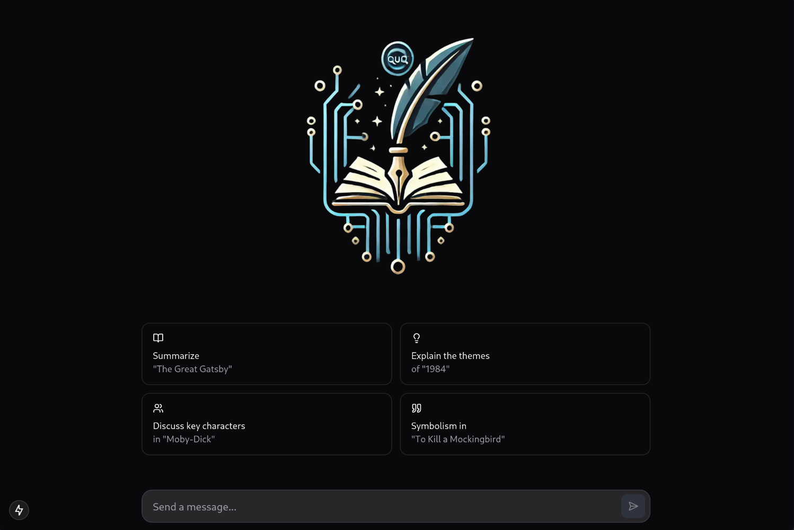
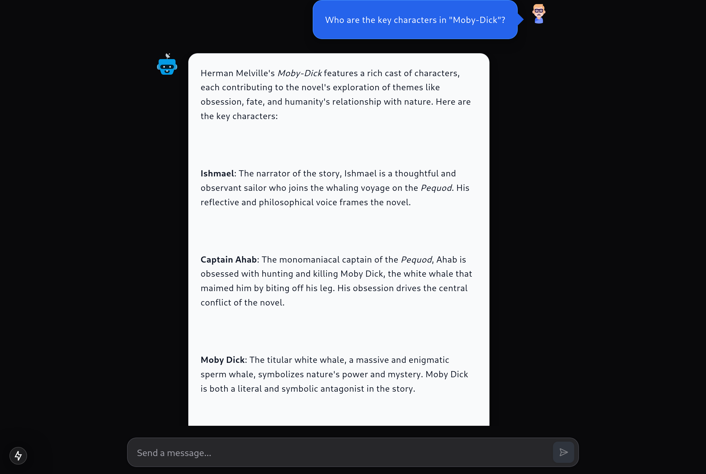

# 📚 ByteBook

ByteBook is an AI-powered book expert designed to answer questions about books, including summaries, themes, character analysis, and recommendations.

## ✨ Features
- 📖 Provides concise, well-structured, and fact-based answers.
- 🎭 Adapts responses based on book genre, era, and literary style.
- 🔍 Offers book recommendations based on user preferences.
- 📊 Compares books across genres, themes, and authors.
- 📝 Provides study guides, reading strategies, and thematic breakdowns.

## 🛠️ Technology Stack
- **Language:** TypeScript
- **Framework:** Next.js
- **AI Model:** GPT-4o (via Azure OpenAI)

## ⚡ Setup Instructions
### 📌 Prerequisites
- Node.js (latest LTS version recommended)
- An API key for Azure OpenAI services

### 📥 Installation
1. Clone the repository:
   ```sh
   git clone https://github.com/your-repo/ByteBook.git
   cd ByteBook
   ```
2. Install dependencies:
   ```sh
   npm install
   ```
3. Set up environment variables:
   - Create a `.env.local` file in the root directory.
   - Add the following variables:
     ```env
     OPENAI_API_KEY=your-api-key
     ```

### ▶️ Running the Project
```sh
npm run dev
```
## ⚠️ Limitations
- 🚫 Does not generate full copies of copyrighted books.
- 🎯 Avoids personal opinions and provides literary analysis instead.
- 📌 Suggests alternative sources or similar books for obscure works.

## 🤝 Contribution
Feel free to open issues and submit pull requests to improve ByteBook.

### 🏠 Home Page


### 📌 App Usage


## 📜 License
This project is licensed under the MIT License.

